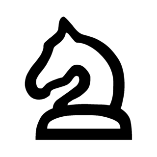

    
    
    
    
    
    
    
    
    
    
    
    

Sample UI for fatpup chess library based on SFML 2. It's currently a user - engine game using a simple 3-ply minimax chess engine. You always play white.

## Get the code
fatpup chess engine is submodule'd, so you have to pull it separately:

    git clone https://github.com/witaly-iwanow/fatpup-ui-sfml.git
    cd fatpup-ui-sfml
    git submodule update --init --recursive

## Build (macOS)
Install SFML with Homebrew:

    brew install sfml

Throw it under CMake, make it and run:

    mkdir _cmake && cd _cmake
    cmake ..
    make && ./fatpup-ui

or if you need an Xcode project:

    cmake -GXcode ..
    Open fatpup-ui.xcodeproj

## Build (Linux)
<coming up>

